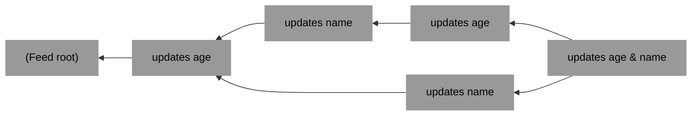
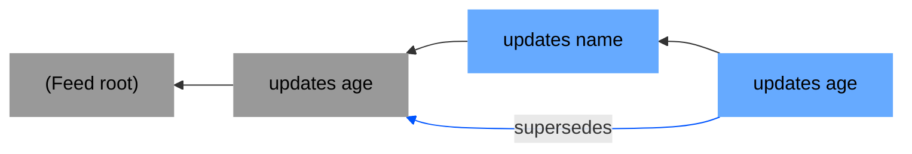
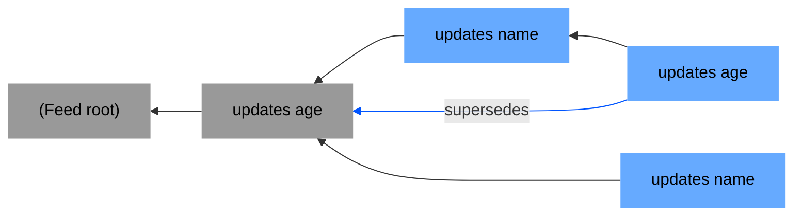
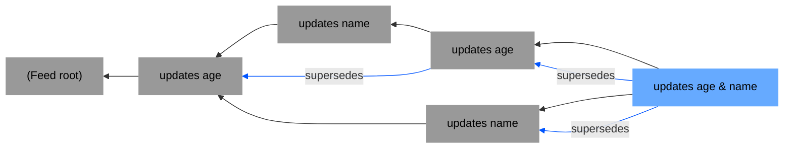

## Feed tangle

(Lipmaa backlinks are not shown in the diagram below, but they should exist)



Reducing the tangle above in a topological sort allows you to build a record
(a JSON object) `{age, name}`.

## Msg type

`msg.metadata.type` MUST start with `record_v1__`. E.g. `record_v1__profile`.

## Msg content

`msg.content` format:

```typescript
interface MsgContent {
  update: Record<string, any>,
  supersedes: Array<MsgHash>,
}
```

RECOMMENDED that the `msg.content.update` is as flat as possible (no nesting).

## Supersedes links

When you update a field in a record, in the `supersedes` array you MUST point
to the currently-known highest-depth msg that updated that field.

The set of *not-transitively-superseded-by-anyone* msgs comprise the
"field roots" of the record. To allow pruning the tangle, we can delete
(or, if we want to keep metadata, "erase") all msgs preceding the field roots.

Suppose the tangle is grown in the order below, then the field roots are
highlighted in blue.


----


-----




-----



-----



